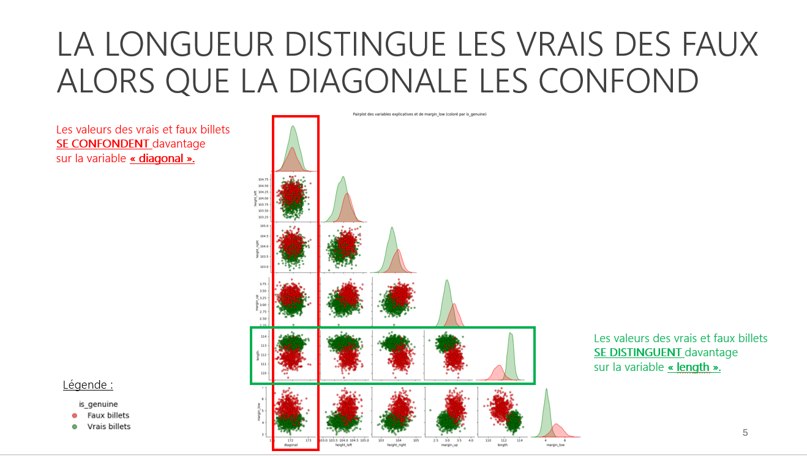
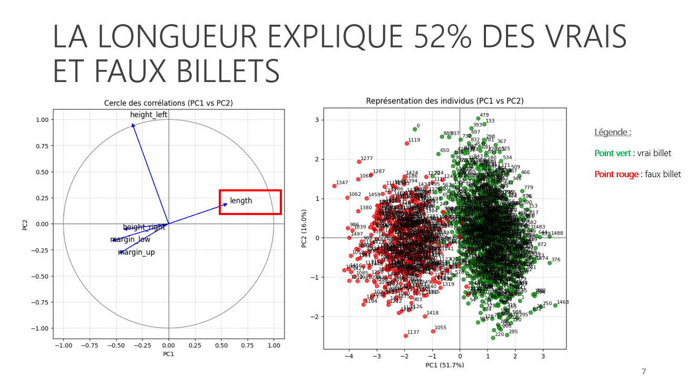
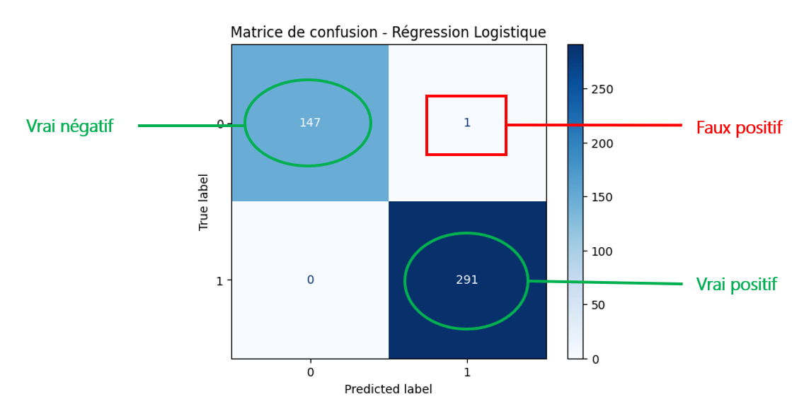
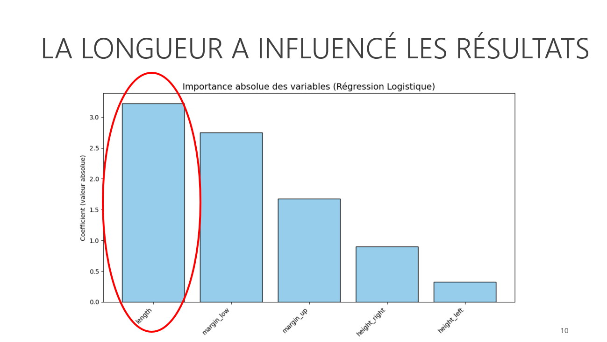
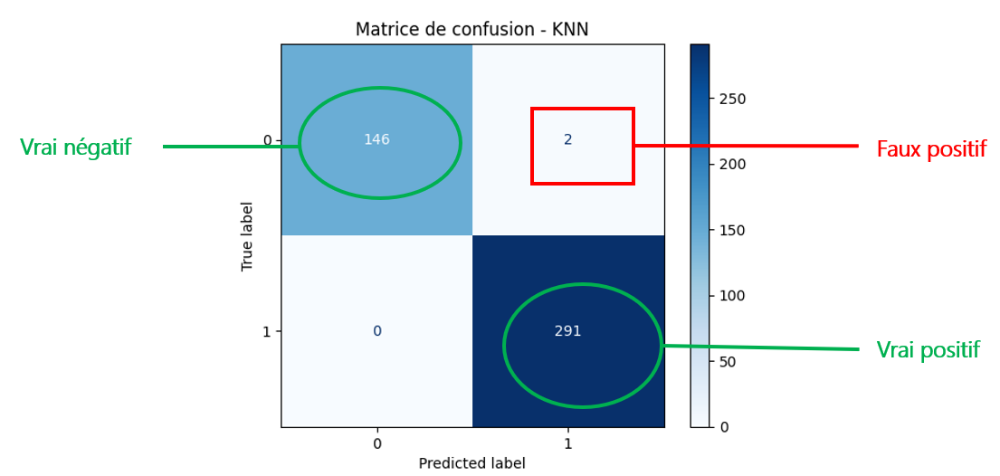
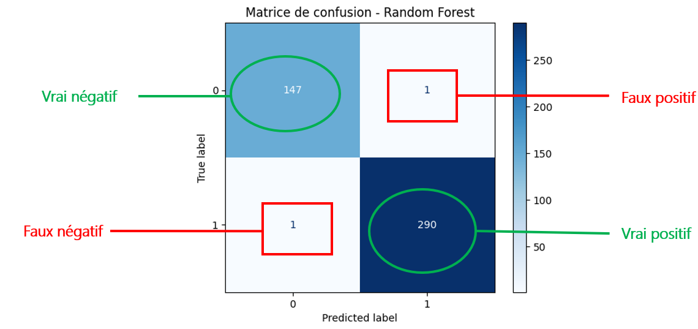

# Projet 12 - Détectez des faux billets avec Python

## Contexte
En tant que **Data Analyst** pour l’**ONCFM (Organisation Nationale de Lutte Contre le Faux-Monnayage)**, la mission consiste à mettre à disposition des équipes une application de **machine learning** capable d’identifier les faux billets en euros afin de lutter contre la contrefaçon.

---

## Objectifs pédagogiques
- Utiliser un **modèle d’apprentissage supervisé** pour réaliser une prédiction
- Entraîner un **modèle d’apprentissage non supervisé** pour exploiter et analyser les données

---

## Outils utilisés
- **Python**
- Librairies de data science et de machine learning  
  (pandas, numpy, matplotlib, seaborn, scikit-learn)

---

## Données
- Échantillon de **1500 billets**
  - 1000 vrais billets
  - 500 faux billets
- Présence de **37 lignes avec des valeurs manquantes**

Les valeurs manquantes ont été estimées à l’aide d’une **régression linéaire** construite à partir des données complètes.

---

## Méthodologie
1. Nettoyage et préparation des données  
2. Estimation des valeurs manquantes par régression linéaire  
3. Séparation des données :
   - **70 %** jeu d’entraînement
   - **30 %** jeu de test  
4. Analyse exploratoire :
   - Pairplot
   - Cercle des corrélations
   - Projection des individus sur le plan factoriel  
5. Entraînement et comparaison de plusieurs algorithmes de classification

---

## Algorithmes testés
- **Régression logistique**  
  Modèle supervisé adapté à la classification

- **KNN (K-Nearest Neighbors)**  
  Modèle supervisé non linéaire basé sur la similarité entre observations  
  (« qui se ressemblent, s’assemblent »)

- **Random Forest**  
  Algorithme supervisé non linéaire basé sur l’agrégation de plusieurs arbres de décision

- **K-means**  
  Modèle non supervisé permettant de regrouper des individus aux caractéristiques similaires

---

## Résultats
- La **longueur** du billet est la variable la plus discriminante entre vrais et faux billets
- Les analyses factorielles confirment l’importance de cette variable
- Le modèle le plus performant est la **régression logistique** :
  - **Accuracy score : 0,997**
  - Une seule erreur de classification (**faux positif**)

Dans le contexte de la lutte contre la contrefaçon, il est préférable de classer un vrai billet comme faux (pour vérification) plutôt que de laisser circuler un faux billet.

---

## Compétences acquises
- Utilisation d’algorithmes de classification supervisée  
  (régression logistique, KNN, random forest)
- Séparation d’un jeu de données en **train / test**
- Analyse des performances :
  - Accuracy score
  - Matrice de confusion
  - Faux positifs / faux négatifs
- Estimation de valeurs manquantes par **régression linéaire**
- Analyse exploratoire de données (EDA)

---

## Illustrations

### Analyse exploratoire – Pairplot

### Cercle des corrélations

### Modèle de régression logistique

### Importance de la longueur

### Classification KNN

### Modèle Random Forest

